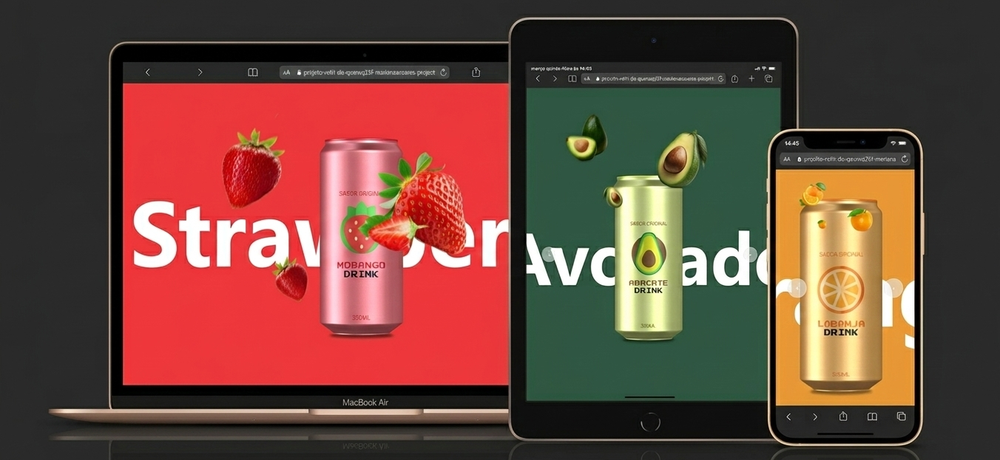

# :wrench:Irmãos Mario Encanadores

<p>Uma landing page moderna e responsiva desenvolvida para apresentar serviços de encanamento de forma clara, profissional e visualmente atrativa. O projeto foi criado com foco em prática de desenvolvimento front-end, explorando conceitos de layout responsivo, organização de seções e experiência do usuário.</p>

🔗 Deploy: https://projeto-encanadores.vercel.app/

📁 Repositório: https://github.com/MarianaASoares/projeto-encanadores

---

 # :rocket:Tecnologias

   

---

# :camera: Preview

   

  
🔗 [Ver projeto](https://projeto-encanadores.vercel.app/)

---


# :globe_with_meridians:Funcionalidades
  <p> :pager:Menu de navegação - Fácil acesso às seções do site.</p>
  <p> :telephone_receiver:Botão do WhatsApp - Redireciona os usuários diretamente para o WhatsApp dos encanadores, facilitando o contato.</p>
  <p> :mailbox_closed:Formulário de contato - Ao clicar no botão "Entre em contato", um formulário é exibido solicitando: </p>
  <ul>
    <li>Nome</li>
    <li>Número de telefone</li>
    <li>Descrição do serviço desejado</li>
  </ul>
  <p> Após o envio, os dados são enviados por e-mail para os encanadores através de um sistema. </p>

 
---

# :file_folder: Como executar localmente

```bash
git clone https://github.com/MarianaASoares/projeto-encanadores.git

cd projeto-encanadores
```

<p>Depois, basta abrir o index.html no navegador.</p>


